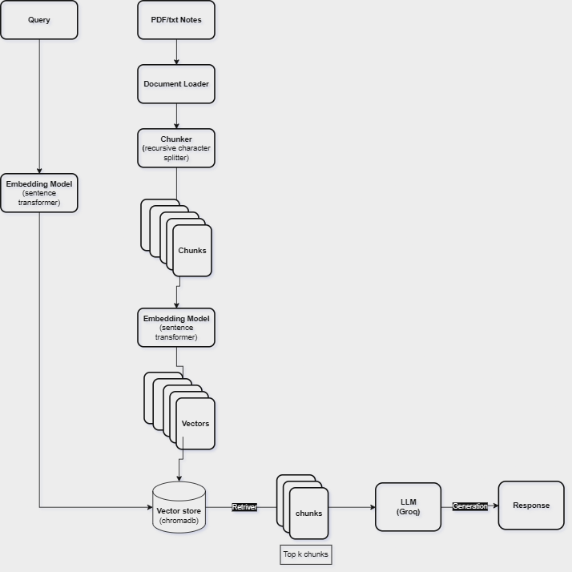

# AI Notes Assistant

A Retrieval-Augmented Generation (RAG) application that allows users to upload a PDF document and ask natural language questions about its content. The system combines semantic search, keyword search, and a Large Language Model (LLM) to provide accurate, context-aware answers grounded in the uploaded document.

## Features

- Upload PDF documents
- Extract and process document content
- Recursive text chunking
- Vector-based semantic retrieval using ChromaDB
- Keyword retrieval using BM25
- Hybrid retrieval (Semantic + Keyword Search)
- LLM-powered answer generation using Groq
- Simple Streamlit web interface
- Environment variable support using `.env`

## Project Architecture

